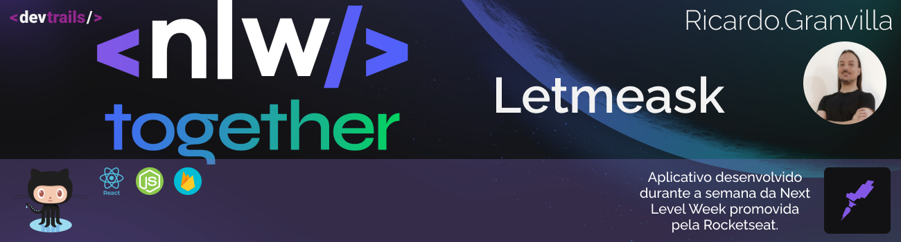
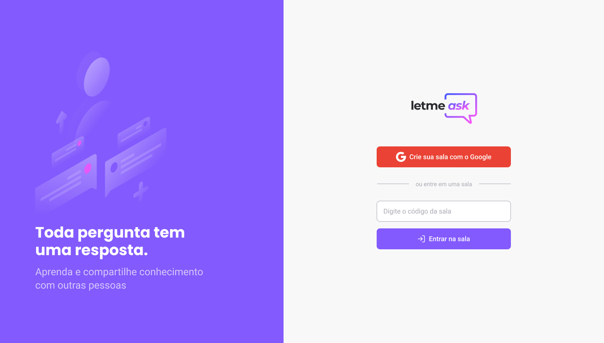
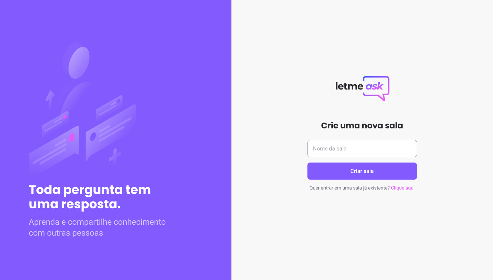
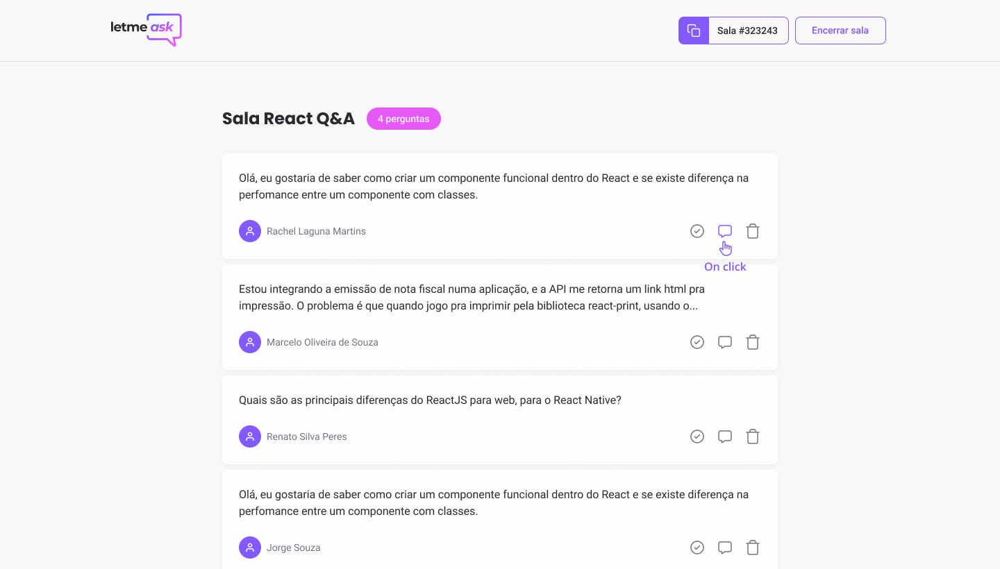
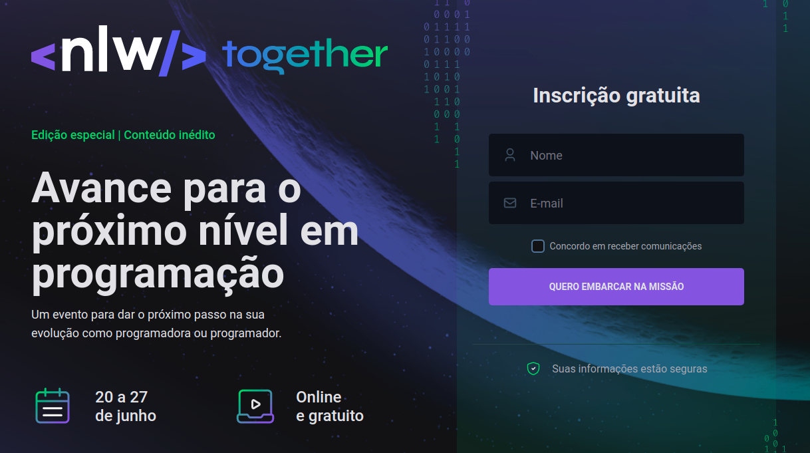
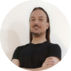

[](https://home.devtrails.com.br/)

<h3 align="center">
<br>
🚧 NLW#6 - Trilha ReactJS - Letmeask 1.0 🚀 em construção... 🚧
<br>
<br>

<p align="center">

  

  
  
  

  

  

</p>
</h3>

# Letmeask 1.0

<br>
<br>

## 💻 **Sobre o projeto**

<br>

Nesta edição do Next Level Week, iremos desenvolver uma aplicação para que o usuário possa fazer perguntas a outros usuários e assim receber uma resposta da comunidade, chamada Letmeask.
Para isso iremos utilizar o React, Typescript e Firebase.

Se você quer acompanhar as minhas anotações diárias sobre o projeto, com o passo
a passo do que foi feito nele, acesse
[NLW #6 - Personal Notes - Dia 1](https://www.notion.so/Next-Level-Week-6-1-Dia-f7fd9085808c46ee8dba7d9352e522d1)
[NLW #6 - Personal Notes - Dia 2](https://www.notion.so/Next-Level-Week-6-2-Dia-7530502a78614f08abf0a9c8310a10c9)
e me acompanhe nas redes sociais Twitter e Linkedin(links no final da página).
<br> <br>

## 📖 **Tabela de conteúdos**

<br>

- [Sobre o projeto](#-sobre-o-projeto)
- [Tabela de Conteúdo](#-tabela-de-conteúdos)
- [Funcionalidades](#-funcionalidades)
- [Layout](#-layout)
- [Tecnologias](#-tecnologias)
- [Pré-requisitos](#-pré-requisitos)
- [Autor](#-autor)

<br>

## 🔩 **Funcionalidades**

<br>

- [x] Criação de um projeto Firebase
- [x] Autenticação com Firebase
- [x] Roteamento e Navegação
- [x] Criação de contextAPI
- [x] Criação de hooks

A milha extra:

- [ ] Deploy da aplicação
- [x] Switch para tema Dark/Ligth
- [ ] Fazer a responsividades do projeto
- [ ] ( --- TO DO ---)

<br>

## 🎨 **Layout**

<br>

<p align="center">
  
  
  <br>
  Tela Inicial - Letmeask
  <br>
  <br>
</p>
<p align="center">
  
  
  <br>
  Criar nova sala - Letmeask
  <br>
  <br>
</p>
<p align="center">
  
  
  <br>
  Sala React Q&A - Letmeask
</p>

Acesse [NLW #6 - Figma Layout](<https://www.figma.com/file/prItZM7WRDQNAOPwDxKujP/Letmeask-(Copy)?node-id=45%3A3279>) para visualizar todo o layout que iremos utilizar para nossa aplicação.
<br>
<br>

## 🛠 Tecnologias

<br>

Foram utilizadas as seguintes ferramentes no desenvolvimento do projeto:

- [TypeScript](https://www.typescriptlang.org/)
- [React](https://pt-br.reactjs.org/)
- [Firebase](https://firebase.google.com/)

<br>
<br>

## 🖥 Pré-requisitos

<br>

Antes de começar, você vai precisar ter instalado em sua máquina as seguintes
ferramentas [Git](https://git-scm.com), [Node.js](https://nodejs.org/en/).

Além disto é bom ter um editor para trabalhar com o código como
[VSCode](https://code.visualstudio.com/). <br> <br>

### 💽 Copiando o repositório

<br>

Com o Github instalado no seu computador, abra o terminal acesse a pasta onde
deseja baixar o repositório e execute o comando abaixo.

```bash
# Clone este repositório
$ git@github.com:rgranvilla/nlw-6_Letmeask.git

# Acesse a pasta do projeto no terminal/cmd
$ cd letmeask


# Instale as dependências
$ yarn

# Execute a aplicação em modo de desenvolvimento
$ yarn dev

# O servidor inciará na porta:3000 - acesse <http://localhost:3000>
```

<br>
<br>

<h2 align="center">

🎉 Parabéns! 🎉

</h1>

<p align="center">


</P>
<br>

Se você chegou até aqui, estará com o aplicativo rodando em sua máquina.
Sinta-se a vontade para modificar, melhorar e sugerir modificações na aplicação.
Se você gostou do repositório marque uma **Estrela** 🌟.

<br>
<br>

# 🤓 Autor

<br>
<p align="center">
Importante: esse aplicativo é de autoria da Rocketseat desenvolvido para a Next Level Week #6
<br>
<br>

<a href="https://nextlevelweek.com/">



<p align="center">
acesse e inscreva-se ou aguarde a nova edição
</p>
</a>
<br>
</p>

## Letmeask Versão 1.0 por

<br>

[](https://github.com/rgranvilla)

<a href="https://github.com/rgranvilla">Ricardo Granvilla 🚀</a>

Desenvolvido com muito carinho 😉 para você 👋 Entre em contato! <br>

[](https://twitter.com/rgranvilla)
[](https://www.linkedin.com/in/rgranvilla/)
[](mailto:rgranvilla@gmail.com)

<br>
<br>
